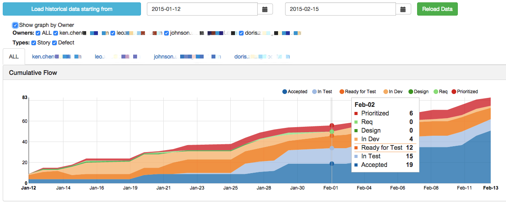
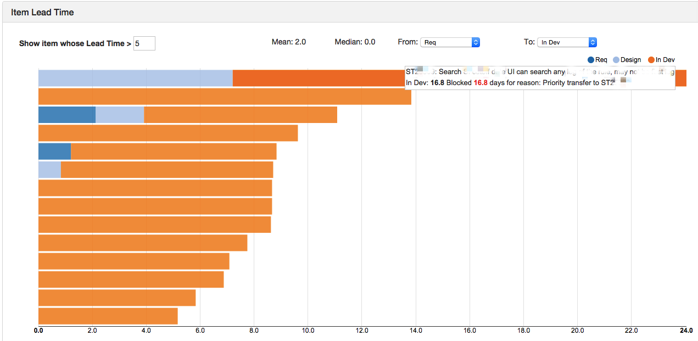
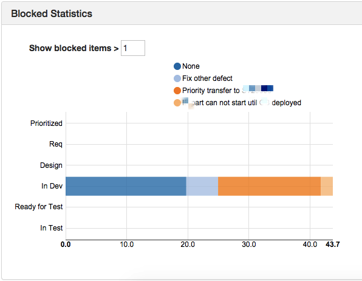

## Introduction

[Rally]: https://www.rallydev.com/

This is a lightweight application to build Kanban CFD graph and shows Kanban item detail for analysis. It allows for extracting data from different provider.  Currently it only supports [Rally][] as our company is using it. :P

The graph is by designed to allow showing data grouping by different owner in different tab.  The intention is to allow each owner to compare their graph to the overall or other owners' statistics to see where they can see the problem from.  I think this encourage each owner to see same graph with different insight.

Below are some sample screens to illustrate its functionalities.

### Cumulative Flow Diagram



### Item Lead Time

Shows item lead time by specifying the Start and End stage you defined in Kanban system with Median and Mean lead time calculated.  You can further filter the items to show based on a lead time threshold.

When you mouse over an item, it will further tell how long it spends on one stage and even how long it's blocked for any particular reason.



### Blocked Statistics

This graph is showing blocked statistics grouped by Kanban stage and blocked reason.  In order to not blowing the graph, the blocked reason is probably best to limit to particular category, say Priority Switched, Prod Support, Resource Limited, Env Down, etc.



*Note:*

1. Button *"Load historical data starting from"* only takes start date for initialization.  It loads item detail & snapshot from that day to today.

2. Button *"Reload Data"* refresh graphs based on the start & end date from the data loaded before.


## Mechanism & Configuration

### Mechanism

Cumulative Flow diagram is cumulative by its nature and most systems do not support directly.  Even if some system has historical data query (like Rally), it wouldn't be efficient to query and build the graph fast enough using historical data especially the graph period is long.

This application runs a schedule job at configrable time daily to capture a snapshot of Kanban Item Status in the system (say, Rally).  The snapshot data is the foundation of CFD graph.

### Configuration
File `server\config.js` presents all of the configrable options which is data provider independent.

All of them should be straightforward as comment is provided.


## Data Provider

### If you are using Rally

You should only need to change user account & project related setting in `server\dataprovider\rally.js`.

```javascript
var rallyUser = ''; // Rally account name
var rallyPassword = ''; // Rally password
var lookbackPageSize = 2000; // Rally API page size
var wsPageSize = 100; // Max is 100
var workspace = 123456789; // Rally workspace id
var project = 987654321; // Rally project id in workspace
var kanbanFieldName = 'c_KanbanState'; // Your Kanban customized field name
```

### If you are not using Rally

You have to write a customized data provider class yourself.

The data provider only need to provide below API:

* getHistoricalKanbanStatus

_getHistoricalKanbanStatus_ is called when you want to extract data from your system to this app.  It should normally be called once as later it will have schedule job to do the work for you.

It expects to have a single date string input.  Its output expects to be a Promise which resolves to be an array of below object:

```javascript
{
  objectID: , // Unique Kanban item Id
  type: , // Kanban item type matches the keys of kanbanItemTypes
  name: , // Kanban item name to show in Item Detail graph
  owner: , // Kanban item owner
  statusChangeLog: [{
    from: ,
    to: , // from & to value should be ISO format date string
    status: // Kanban status name matches the kanbanStatusNames
  }], // List of object describes the Kanban status period
  blockLog: [{
    blocked: , // true or false to indicate it's blocked or not
    stage: , // At what Kanban stage it is blocked
    time: , // the time at which it's marked as blocked or unblocked
    reason: // blocked reason
  }],
  kanbanizedOn: // Earliest time this item is in Kanban System
}
```

## How to use

### Install dependency

```
$ bower install

$ npm install
```

### Start server

```
$ node index.js
```

Check the Kanban CFD graph through the server URL and port as you configure in `server\config.js`.  For example:

`http://localhost:3000`


## License

(The MIT License)

Copyright (c) 2009-2013 Ken Chen <chengusky@gmail.com>

Permission is hereby granted, free of charge, to any person obtaining
a copy of this software and associated documentation files (the
'Software'), to deal in the Software without restriction, including
without limitation the rights to use, copy, modify, merge, publish,
distribute, sublicense, and/or sell copies of the Software, and to
permit persons to whom the Software is furnished to do so, subject to
the following conditions:

The above copyright notice and this permission notice shall be
included in all copies or substantial portions of the Software.

THE SOFTWARE IS PROVIDED 'AS IS', WITHOUT WARRANTY OF ANY KIND,
EXPRESS OR IMPLIED, INCLUDING BUT NOT LIMITED TO THE WARRANTIES OF
MERCHANTABILITY, FITNESS FOR A PARTICULAR PURPOSE AND NONINFRINGEMENT.
IN NO EVENT SHALL THE AUTHORS OR COPYRIGHT HOLDERS BE LIABLE FOR ANY
CLAIM, DAMAGES OR OTHER LIABILITY, WHETHER IN AN ACTION OF CONTRACT,
TORT OR OTHERWISE, ARISING FROM, OUT OF OR IN CONNECTION WITH THE
SOFTWARE OR THE USE OR OTHER DEALINGS IN THE SOFTWARE.
