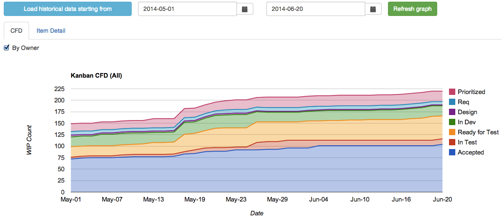
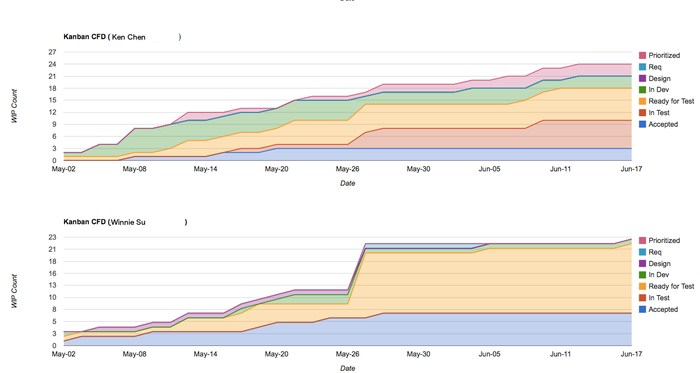
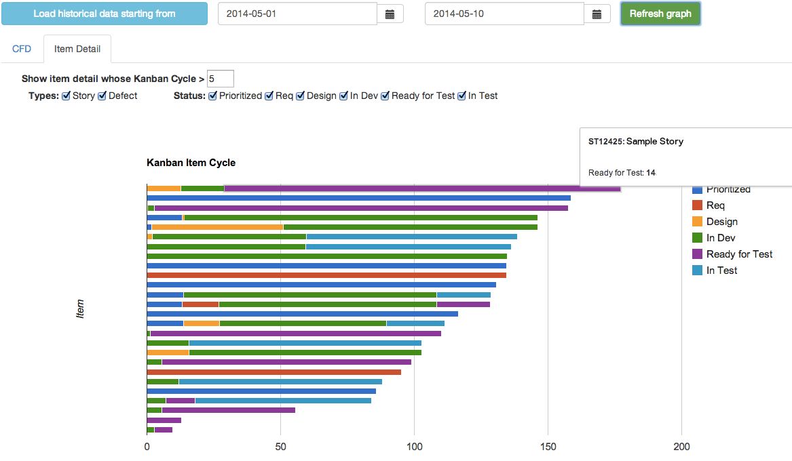

## Introduction

This is a lightweight application to build Kanban CFD graph and shows Kanban item detail for analysis. It allows for extracting data from different provider.  Currently it only supports Rally as our company is using it. :P

Below are some sample screens to illustrate its functionalities.

### Overall Cumulative Flow Diagram



### Cumulative Flow Diagram by item owner



### Kanban Item Detail

Supports item type, status and overall duration filtering.



*Note:*

1. Button *"Load historical data starting from"* only takes a parameter of start date in fisrt time initialization.  It loads snapshot from that day to today.

2. Button *"Refresh grapth"* only refresh graph (CFD / Item Detail) in current visible tab.


## Mechanism & Configuration

### Mechanism

Cumulative Flow diagram is cumulative by its nature and most systems do not support directly.  Even if some system has historical data query (like Rally), it wouldn't be efficient to query and build the graph fast enough using historical data especially the graph period is long.

This application runs a schedule job at configrable time daily to capture a snapshot of Kanban Item Status in the system (say, Rally).  The snapshot data is the foundation of CFD graph.

### Configuration
File `server\config.js` presents all of the configrable options which is data provider independent.

Most of them should be strangeforward as comment is provided.


## Data Provider

### If you are using Rally

You should only need to change user account & project related setting in `server\dataprovider\rally.js`.

```javascript
var rallyUser = ''; // Rally account name
var rallyPassword = ''; // Rally password
var lookbackPageSize = 2000; // Rally API page size
var wsPageSize = 100; // Max is 100
var workspace = 123456789; // Rally workspace id
var project = 987654321; // Rally project id in workspace
var kanbanFieldName = 'c_KanbanState'; // Your Kanban customized field name
```

### If you are not using Rally

You have to write a customized data provider class yourself.

The data provider should contain below two API only:

* getHistoricalKanbanStatus
* itemSnapshotNow

_getHistoricalKanbanStatus_ is called when you want to extract data from your system to this app.  It should normally be called once as later it will have schedule job to do the work for you.

It expects to have a single date string input.  Its output expects to be a Promise which resolves to be an array of below object:

```javascript
{
  objectID: , // Unique Kanban item Id
  type: , // Kanban item type matches the keys of kanbanItemTypes
  name: , // Kanban item name to show in Item Detail graph
  owner: , // Kanban item owner
  statusChangeLog: [{
    from: ,
    to: , // from & to value should be ISO format date string
    status: // Kanban status name matches the kanbanStatusNames
  }], // List of object describes the Kanban status period
  kanbanizedOn: // Earliest time this item is in Kanban System
}
```

_itemSnapshotNow_ is called by daily schedule job.

It expects no input parameter.  Its output expects to be a Promise which resolves to be an array of below object whose fields are quite similar as above:

```javascript
{
  objectID: ,
  type: ,
  owner: ,
  status: ,
  date: now, // A JS Date object at the time schedule job is run
  name:
}
```

## How to use

### Install dependency

```
$ bower install

$ npm install
```

### Start server

```
$ node index.js
```

Check the Kanban CFD graph through the server URL and port as you configure in `server\config.js`.  For example:

`http://localhost:3000`


## License

(The MIT License)

Copyright (c) 2009-2013 Ken Chen <chengusky@gmail.com>

Permission is hereby granted, free of charge, to any person obtaining
a copy of this software and associated documentation files (the
'Software'), to deal in the Software without restriction, including
without limitation the rights to use, copy, modify, merge, publish,
distribute, sublicense, and/or sell copies of the Software, and to
permit persons to whom the Software is furnished to do so, subject to
the following conditions:

The above copyright notice and this permission notice shall be
included in all copies or substantial portions of the Software.

THE SOFTWARE IS PROVIDED 'AS IS', WITHOUT WARRANTY OF ANY KIND,
EXPRESS OR IMPLIED, INCLUDING BUT NOT LIMITED TO THE WARRANTIES OF
MERCHANTABILITY, FITNESS FOR A PARTICULAR PURPOSE AND NONINFRINGEMENT.
IN NO EVENT SHALL THE AUTHORS OR COPYRIGHT HOLDERS BE LIABLE FOR ANY
CLAIM, DAMAGES OR OTHER LIABILITY, WHETHER IN AN ACTION OF CONTRACT,
TORT OR OTHERWISE, ARISING FROM, OUT OF OR IN CONNECTION WITH THE
SOFTWARE OR THE USE OR OTHER DEALINGS IN THE SOFTWARE.
